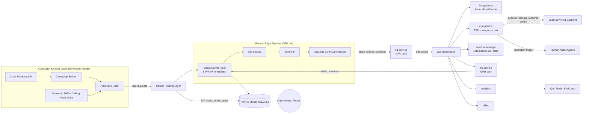
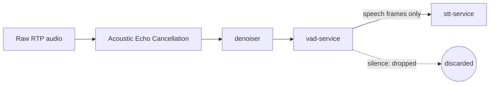

# Architecture

## Problem statement (summary)

An outbound voice agent that autonomously calls borrowers behind on loan payments: verifies identity, discloses the overdue amount, negotiates a payment date/plan, handles objections (dispute, hardship, wrong number, callback request), logs the outcome, and escalates to a human whenever the conversation goes outside its competence.

**Scale target: 1,000,000,000 calls/day**, taken literally. In operational terms (full derivation in [scaling.md](scaling.md)): ~23,000-37,000 calls/sec during a realistic 12-hour legal calling window, and **~2.2M concurrent active calls at peak**.

**Honest sanity check:** this is larger than the total daily call volume of most national telecom networks. The hard constraint at this scale isn't the AI stack (ASR/LLM/TTS) — that scales roughly linearly with GPUs, a large but conventional infra problem. The hard constraint is **PSTN termination capacity**: no single carrier sells 2M+ concurrent outbound channels, so multi-carrier trunking is a first-class architectural concern, not an afterthought. This is a telecom-industry/regulatory scaling problem as much as a software one — flagged here rather than glossed over.

## High-level flow

## Component responsibilities (mapped to services/)

| Component | Service folder | Responsibility |
|---|---|---|
| Campaign & dialer | `services/scheduler` | Live consent/DND/calling-hours gate before every dial; paces attempts against expected answer rate (AMD). |
| Carrier routing | *(infra, not a service)* | Multi-carrier SIP trunking, STIR/SHAKEN attestation, number-pool reputation management. |
| Media servers | *(infra: FreeSWITCH/Jambonz fleet)* | SIP/RTP termination; hosts the CPU-tier edge pipeline. |
| VAD | `services/vad-service` | Frame-level speech detection + end-of-speech hangover timing. |
| Denoiser | `services/denoiser` | Real-time speech enhancement ahead of ASR. |
| ASR | `services/stt-service` | Streaming speech-to-text, GPU pool. |
| NLU / intent | `services/llm-gateway` | Classifies borrower utterances into the fixed intent set. |
| Call-flow / compliance | `services/compliance` | The FSM: mandatory disclosures, negotiation flow, escalation triggers — stateless, pure function of (state, intent). |
| TTS | `services/tts-service` | Streaming text-to-speech, GPU pool. |
| Orchestration | `services/call-orchestrator` | Coordinates one call's pipeline turn-by-turn across every other service. |
| Call state | `services/session-manager` | Externalized state store (Aerospike in production, Redis Cluster documented as the alternative) — lets every other service stay stateless. |
| Outcome logging | `services/analytics` | Event logging + rollup quality metrics (see [monitoring.md](monitoring.md)). |
| Cost metering | `services/billing` | Per-call cost tracking against the fleet-level cost model (see [cost-analysis.md](cost-analysis.md)). |
| Policy/FAQ retrieval | `services/rag-service` | Answers off-script questions outside the fixed intent set by retrieving from a vetted knowledge base — grounds `compliance`'s response, never bypasses it. |
| Tool calling | `services/tool-gateway` | The single named-function boundary to external systems (loan servicing backend, CRM) — the bot states a balance or schedules a payment only through a registered tool call, never by inventing a number. |
| Sentiment detection | `services/sentiment-detector` | Tone/emotion classification from audio (calm/frustrated/distressed/angry), feeding `compliance` alongside intent so response strategy — not just content — can adapt. |
| Model routing | `services/model-router` | Routes each turn to a small/fast or larger/capable LLM tier based on utterance complexity, rather than fixing one tier for the whole deployment. |
| Inference routing | `services/inference-router` | Shared batching/load-balancing/model-version-routing layer in front of the GPU pools backing `stt-service`/`llm-gateway`/`tts-service`, instead of each reimplementing it. |

## Components added to close identified gaps

The five services above were not in the original design — they were identified by auditing this architecture against a standard enterprise-conversational-AI component checklist and finding real gaps, not just naming mismatches. Each is a comment-only specification (`services/*/main.py`) describing responsibility, logic/flow, and API contract, consistent with every other service in this repo — none are implemented. See each file for the detailed reasoning; in short:

- **`rag-service`** exists because off-script questions previously had no path except re-prompt-until-give-up or unnecessary escalation.
- **`tool-gateway`** formalizes what was previously an informal "compliance calls the loan servicing backend" narrative into a named, auditable, allow-listed function-call boundary.
- **`sentiment-detector`** closes the gap between *keyword-based* distress detection (already in `llm-gateway`'s intent set) and genuine *tone-based* emotion detection — an agitated borrower who never says a trigger phrase currently gets no different treatment than a calm one.
- **`model-router`** turns "pick one LLM tier for the whole deployment" into a per-turn decision, which is where the real savings are, since most turns in a scripted collections flow are the easy case.
- **`inference-router`** names the batching/load-balancing/version-routing layer that was previously implied to exist "inside" each GPU-tier service rather than shared across all three.

A sixth candidate, **voice-biometric fraud detection**, was considered and deliberately cut rather than added — it imports an inbound-call threat model (verify an unknown caller before granting account access) that doesn't map onto this outbound-only system, where the callee's identity is already known and there's no high-value action for an impersonator to gain. See [future-improvements.md](future-improvements.md) for the full reasoning.

## Key architectural decisions

1. **VAD/denoise at the edge (CPU), ASR/LLM/TTS centralized (GPU).** Keeps expensive compute reserved for actual speech — silence, hold music, and background noise never reach the GPU pools. See "Audio pipeline detail" below.
2. **FSM-first `compliance` service, `llm-gateway` as a component feeding it — not the other way around.** Guarantees compliance-critical disclosures happen every time, bounds response latency (short, templated generations vs. open-ended chat), and bounds cost (fewer, shorter LLM calls). Full justification in the "Technology choices" section below.
3. **Regional, multi-carrier telephony from day one.** The actual scaling bottleneck at 1B calls/day — bolting it on later doesn't work because number reputation and carrier relationships take months to build.
4. **Streaming everywhere.** Every hop (ASR, LLM, TTS) is streaming, not request/response batch, because turn-taking latency is a quality-critical metric in an adversarial conversational context (see [latency-budget.md](latency-budget.md)).
5. **Stateless, horizontally-scalable services; call state lives in `session-manager` (Aerospike in production, keyed by call-id).** Any service instance can crash and be replaced without losing the call, and autoscaling is a simple function of adding more identical replicas. Aerospike was picked over Redis Cluster after comparing both against this system's actual peak load — see `services/session-manager/main.py` for the p99-latency reasoning.
6. **Cache anything that varies by a small, bounded dimension — never anything that varies per account.** `configs/model-versions.yaml`, `configs/feature-flags.yaml`, and `configs/calling-hours.yaml` change on a deployment cadence (minutes to hours), not per-call — every service reading them should load once and refresh on a slow interval, not fetch fresh over the network on every single request. The same principle is why `rag-service`'s knowledge base is cached by `(query, loan_type, region)` rather than by account, and why `scheduler`'s consent/DNC status and carrier number-pool reputation are cached with a TTL instead of queried fresh per dial (see each service's own spec for the specifics) — the common thread is: identify what's actually shared across millions of calls vs. what's genuinely unique to one, and only pay the network/compute cost for the latter.

   **Config caching specifically needs two details right, or it barely helps.** `call-orchestrator` alone runs ~2.2M replicas at peak — a naive cache that has *every pod* independently poll the config store every 30 seconds still generates ~75,000 requests/sec on that store, only a ~2.5x reduction from the ~185,000/sec uncached baseline, because the sheer replica count dominates. The real fix is **both**: (a) a refresh interval matched to how often config actually changes (minutes, not seconds — there's no reason to poll every 30s for something that changes a few times a day), and (b) a **node-local shared cache** (one cache per physical node, read by every pod scheduled on it) instead of one cache per pod. Combined, those two bring it down to roughly 100-1,000x fewer requests on the config store, not 2.5x — the difference between "cached" and "cached correctly" is most of the win here.

   **Number-pool reputation caching doesn't have this trap**, because the cache key is the phone number, not the replica — a simple TTL cache (no node-local complexity needed) already gets a real 4-44x reduction in reputation-check load depending on pool size, and — more importantly than the raw number — it decouples that load from call volume entirely, which matters because call volume is the one thing guaranteed to keep growing at this scale.
7. **Warm GPU pools, not cold starts.** The model weights behind `stt-service`/`llm-gateway`/`tts-service` are the same for every call — loading them is the one-time, reusable cost. Keeping the GPU pools warm (minimum replica counts that never scale to zero, per `infrastructure/kubernetes/hpa.yaml`) means every call reuses an already-loaded model instead of paying a cold-start cost, which would otherwise show up directly in the per-turn latency budget (`docs/latency-budget.md`).

## Technology choices

Every choice is evaluated on **cost at 1B calls/day**, **latency**, and **quality** — full tradeoff table:

| Layer | Chosen | Why | Rejected at this scale |
|---|---|---|---|
| VAD | Silero-VAD (GPU-free, ONNX) | ~1ms/frame on CPU, accurate, zero marginal GPU cost | WebRTC VAD — faster but more false triggers on noisy mobile audio |
| Denoiser | DeepFilterNet (or RNNoise for lowest-CPU tier) | Real-time on CPU, large WER improvement on noisy audio | Cloud denoising APIs — per-minute cost is a non-starter at 1B minutes/day |
| ASR | Self-hosted streaming Conformer / distil-Whisper (CTranslate2 or NVIDIA Riva) | Open-weight, streaming, GPU-batchable, near-Whisper-large accuracy at a fraction of the cost | Cloud ASR APIs — excellent quality, but 20-50x the self-hosted compute cost at this volume |
| NLU + dialogue generation | Small fine-tuned model (1-3B params), served via vLLM/TensorRT-LLM, wrapped by a deterministic FSM | Narrow domain — small model matches large-model quality here at 10-20x lower latency/cost; FSM guarantees required disclosures regardless of model output | Frontier LLM per turn — 50-100x the cost, 300-800ms+ TTFT under load (blows the latency budget), and cannot *guarantee* compliance behavior |
| TTS | Streaming neural TTS (Kokoro-82M-class / Piper) | Low first-byte latency, self-hostable | ElevenLabs/OpenAI TTS APIs — more expressive, but per-minute pricing at this volume is one of the largest cost items |
| Telephony / media server | FreeSWITCH or Jambonz, multi-carrier SIP trunking | Open-source, proven at high concurrency, full control over edge VAD/denoise | Fully-managed platforms (Twilio Voice) — right choice below ~1-5M calls/day, cost-prohibitive well before 1B/day |
| Orchestration / state | Stateless services + Aerospike, Kubernetes autoscaling | Both Aerospike and Redis Cluster clear the required ~370K ops/sec; Aerospike's 17-48% lower p99 latency wins given the tight per-turn latency budget | Redis Cluster — comparable throughput and a more mature ecosystem, documented as the fallback if that's weighted higher; sticky, stateful workers — simpler than either, but a crash loses the call |
| Dialer | Custom predictive dialer with AMD + live consent/DND gating | Wasting bot capacity on voicemail/no-answer is one of the largest hidden costs at scale | Simple round-robin dialing — wastes 60-80% of pipeline capacity on non-connects |

### Why FSM-wrapped LLM, not a free-form agent (the most important decision)

A frontier LLM given a good system prompt behaves well *most of the time*. That isn't an acceptable compliance posture at 1B calls/day — even a 0.01% failure rate on a mandatory disclosure is 100,000 non-compliant calls/day. The `compliance` service's FSM converts compliance-critical behavior from "extremely likely, if prompted well" to "structurally guaranteed," while `llm-gateway`'s small model handles exactly the part that's genuinely hard to do with pure rules: understanding open-ended borrower speech and (in production) paraphrasing within an allowed response template.

## Audio pipeline detail (VAD, denoiser, echo cancellation, barge-in)

Every millisecond of audio reaching the GPU pools costs money. Real phone audio is full of silence, hold-adjacent noise, and background sound — none of which should reach an expensive model.

- **VAD tuning that matters:** hangover/end-of-speech window (~150-250ms — too short interrupts mid-thought, too long feels sluggish), speech-onset threshold (fast enough to catch barge-in without false-triggering on breath/line noise), frame size (~20-30ms).
- **Denoising** runs before ASR (and can help VAD itself distinguish speech from noise in the noisiest cases) — one of the highest-leverage, lowest-cost quality improvements available, since ASR errors compound into intent-misclassification and wrong bot responses.
- **AEC** prevents the bot from "hearing itself" (its own TTS output looping back through the borrower's mic), which is what makes reliable barge-in detection possible.
- **Barge-in mechanics:** VAD runs continuously even during bot playback → speech onset during playback = barge-in → `call-orchestrator` stops reading the `tts-service` stream within ~100ms → new borrower audio routed through the normal pipeline as the next turn. See [latency-budget.md](latency-budget.md).
- **Cost impact of doing this poorly:** an extra 20% of dead-air/noise leaking through to `stt-service` is roughly a 20% inflation of the ASR GPU fleet for zero benefit — thousands of extra GPUs at this scale, for nothing.

## Failure domains & resilience

| Failure | Mitigation |
|---|---|
| Single carrier outage | Multi-carrier routing fails over automatically; no single carrier > ~30% of a region's traffic. |
| GPU pool overload | Backpressure at `scheduler`: throttles new dial attempts if pipeline queue depth exceeds threshold, rather than degrading in-call latency for connected calls. |
| Regional datacenter outage | Multi-region active-active deployment; calls route to the nearest healthy region. |
| `compliance` low-confidence/uncertain state | Hard-coded escalation to human — a wrong guess in a compliance-sensitive conversation is worse than a handoff. |
| Media server crash mid-call | Call drops (acceptable), but state already lives in `session-manager`, so campaign logic doesn't re-attempt a call that actually succeeded. |
| A GPU-tier dependency (`stt-service`/`llm-gateway`/`tts-service`) degrades or goes down | **Circuit breaker, not just retry.** Per-request retry-once-then-fallback (already the pattern throughout `architecture/single-call-flow.html`'s technical flow) handles a single slow request, but doesn't stop *every concurrent call* from independently retrying against a dependency that's clearly failing. A circuit breaker tracks consecutive failures per dependency; past a threshold, it "opens" — new requests fail fast (straight to the same fallback each retry would have reached anyway: re-prompt, or escalate) for a cooldown window, instead of every one of millions of concurrent calls piling retries onto an already-struggling pool. This is what turns "one GPU pool is degraded" into a contained, bounded-impact event instead of a pile-up that makes the outage worse. |
